# Server Deployment Automation 🚀

This project simplifies server setup and deployment with Ansible and a Makefile. It ensures secure and efficient configurations across your infrastructure.

---

## Architecture Overview 🖥️📡

```mermaid
flowchart TB
    subgraph PrivateNetwork [Private Network]
        direction TB
        SRV1[**srv1** - Portainer-EE 🐳 Docker Swarm Node]
        SRV2[**srv2** - Portainer-EE 🐳 Docker Swarm Node]
        SRV3[**srv3** - Portainer-EE 🐳 Docker Swarm Node]
        SRV4[**srv4** - Nginx-OpenPanel 🌐 Hosting Services]
    end
    Internet --> |Secure HTTPS| SRV1
    Internet --> |Secure HTTPS| SRV4
    SRV1 <--> SRV2
    SRV1 <--> SRV3

    classDef network fill:#E0E0E0,stroke:#404040,stroke-width:2px,color:#000000;
    classDef server fill:#F5F5F5,stroke:#808080,stroke-width:2px,color:#000000;
    class Internet network;
    class PrivateNetwork network;
    class SRV1,SRV2,SRV3,SRV4 server;
```



Architecture Overview:

- 🌐 Internet traffic routes directly to Traefik in the Portainer Leader node and Nginx instance
- 🐳 Docker Swarm for containerization
- 🔒 Private network isolation
- 🛡️ Traefik proxy interconnects Portainer nodes

---

## Setup Summary 🔧

1. **Server Hardening:**
    - Creates a serigy user with sudo access.
    - Enables and configures SELinux, Fail2Ban, and Auditd for enhanced security.
    - Configures SSH for secure access.
2. **Docker Installation:**
    - Installs Docker on the first three servers.
    - Configures Docker Swarm for container orchestration.
3. **Portainer-EE and Traefik:**
    - Deploys Portainer-EE for Swarm management.
    - Configures Traefik as the reverse proxy with Let's Encrypt for HTTPS.

---

## How to Use 🛠️

### Prerequisites

1. Install Ansible on your control machine.
2. Prepare your inventory.yml file with the IPs of all your servers.

#### Steps

1. Clone this`repository:

```bash
git clone https://github.com/your-repo/server-deployment.git
cd server-deployment
```

2. Customize `inventory.yml` to match your server details.
3. Run the setup process with the Makefile:
    - **Harden servers:**

    ```bash
    make setup
    ```

    - **Install Docker:**

    ```bash
    make docker
    ```

    - **Configure Swarm:**

    ```bash
    make swarm
    ```

---

### Commands Summary 📝

| Command | Description |
| ------- | ----------- |
| make setup | Hardens servers and creates users. |
| make docker | Installs Docker on servers. |
| make swarm | Sets up Swarm and Portainer-EE. |
